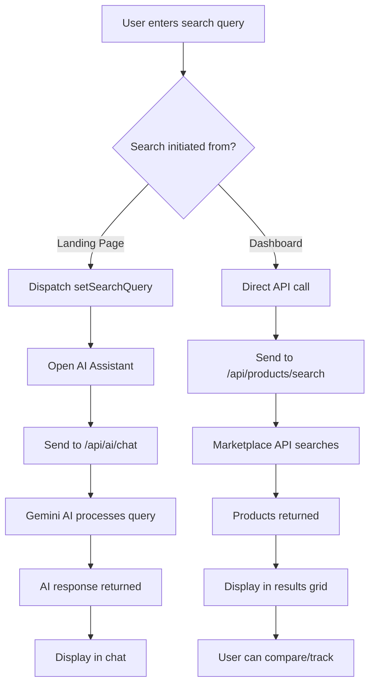
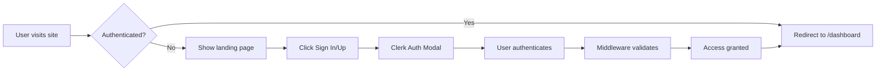
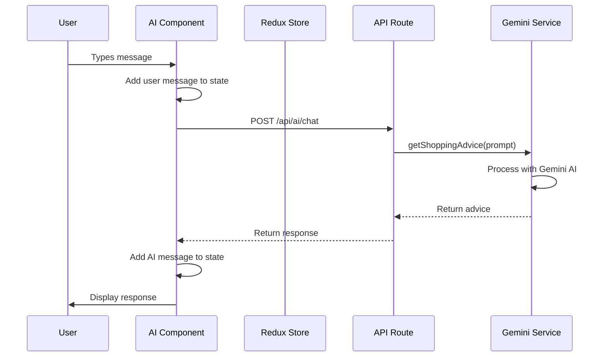
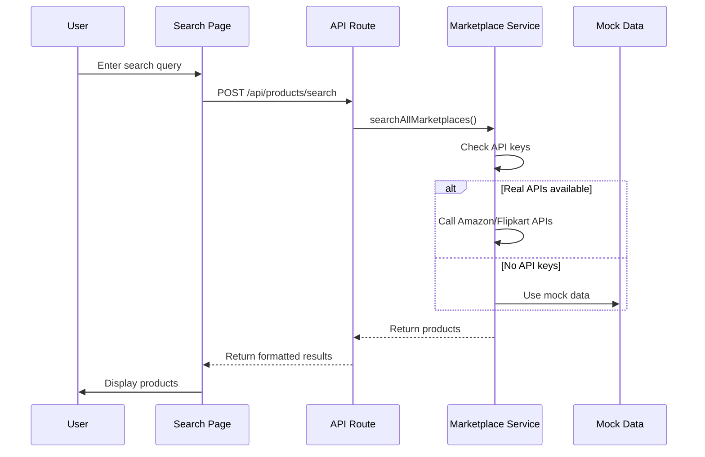

# Carta - Complete Project Documentation

## 📋 Table of Contents
1. [Project Overview](#project-overview)
2. [System Architecture](#system-architecture)
3. [Technology Stack](#technology-stack)
4. [Project Structure](#project-structure)
5. [Data Flow](#data-flow)
6. [Component Architecture](#component-architecture)
7. [API Routes](#api-routes)
8. [State Management](#state-management)
9. [Authentication Flow](#authentication-flow)
10. [Feature Modules](#feature-modules)
11. [Deployment](#deployment)

---

## 🎯 Project Overview

**Carta** is an AI-powered personal shopping agent that helps users search, compare, and save money across multiple Indian e-commerce marketplaces.

### Key Features
- 🤖 **AI-Powered Search**: Natural language product search using Google Gemini
- 🔍 **Multi-Marketplace**: Search across Amazon, Flipkart, Myntra, AJIO, and Meesho
- 📊 **Smart Comparison**: Side-by-side product comparison
- 📈 **Price Tracking**: Historical price data and alerts
- 💬 **AI Assistant**: Real-time shopping advice
- 🎨 **Modern UI**: Clean, minimal design with dark mode support

### Project Metadata
- **Name**: Carta (CartaX)
- **Version**: 0.1.0
- **Framework**: Next.js 16.2.4
- **Language**: TypeScript 5
- **License**: MIT

---

## 🏗️ System Architecture

### High-Level Architecture

```
┌─────────────────────────────────────────────────────────────────┐
│                         CLIENT LAYER                             │
│  ┌──────────────┐  ┌──────────────┐  ┌──────────────┐          │
│  │   Browser    │  │  Mobile Web  │  │   Desktop    │          │
│  └──────┬───────┘  └──────┬───────┘  └──────┬───────┘          │
│         │                  │                  │                   │
│         └──────────────────┴──────────────────┘                   │
│                            │                                      │
└────────────────────────────┼──────────────────────────────────────┘
                             │
┌────────────────────────────┼──────────────────────────────────────┐
│                    PRESENTATION LAYER                             │
│                            │                                      │
│  ┌─────────────────────────▼────────────────────────┐            │
│  │         Next.js App Router (React 19)            │            │
│  │  ┌──────────┐  ┌──────────┐  ┌──────────┐       │            │
│  │  │  Pages   │  │Components│  │  Layouts │       │            │
│  │  └──────────┘  └──────────┘  └──────────┘       │            │
│  └──────────────────────────────────────────────────┘            │
│                            │                                      │
└────────────────────────────┼──────────────────────────────────────┘
                             │
┌────────────────────────────┼──────────────────────────────────────┐
│                     STATE MANAGEMENT                              │
│  ┌─────────────────────────▼────────────────────────┐            │
│  │           Redux Toolkit Store                    │            │
│  │  ┌──────────────┐  ┌──────────────┐             │            │
│  │  │ Shopping     │  │  UI State    │             │            │
│  │  │ Slice        │  │  Slice       │             │            │
│  │  └──────────────┘  └──────────────┘             │            │
│  └──────────────────────────────────────────────────┘            │
└────────────────────────────┼──────────────────────────────────────┘
                             │
┌────────────────────────────┼──────────────────────────────────────┐
│                       API LAYER                                   │
│  ┌─────────────────────────▼────────────────────────┐            │
│  │         Next.js API Routes                       │            │
│  │  ┌──────────────┐  ┌──────────────┐             │            │
│  │  │  /api/ai     │  │ /api/products│             │            │
│  │  │  /chat       │  │  /search     │             │            │
│  │  └──────────────┘  └──────────────┘             │            │
│  └──────────────────────────────────────────────────┘            │
└────────────────────────────┼──────────────────────────────────────┘
                             │
┌────────────────────────────┼──────────────────────────────────────┐
│                    BUSINESS LOGIC LAYER                           │
│  ┌─────────────────────────▼────────────────────────┐            │
│  │              Core Services                       │            │
│  │  ┌──────────────┐  ┌──────────────┐             │            │
│  │  │   Gemini     │  │ Marketplace  │             │            │
│  │  │   Service    │  │   Service    │             │            │
│  │  └──────────────┘  └──────────────┘             │            │
│  └──────────────────────────────────────────────────┘            │
└────────────────────────────┼──────────────────────────────────────┘
                             │
┌────────────────────────────┼──────────────────────────────────────┐
│                    EXTERNAL SERVICES                              │
│  ┌──────────┐  ┌──────────┐  ┌──────────┐  ┌──────────┐         │
│  │  Clerk   │  │ Supabase │  │  Gemini  │  │Marketplace│         │
│  │  Auth    │  │    DB    │  │    AI    │  │   APIs   │         │
│  └──────────┘  └──────────┘  └──────────┘  └──────────┘         │
└───────────────────────────────────────────────────────────────────┘
```

---

## 🛠️ Technology Stack

### Frontend
| Technology | Version | Purpose |
|------------|---------|---------|
| **Next.js** | 16.2.4 | React framework with App Router |
| **React** | 19.2.4 | UI library |
| **TypeScript** | 5.x | Type safety |
| **Tailwind CSS** | 4.x | Styling |
| **Framer Motion** | 12.38.0 | Animations |
| **Radix UI** | 1.4.3 | Accessible components |
| **shadcn/ui** | 4.3.0 | UI component library |
| **Lucide React** | 0.453.0 | Icons |

### State Management
| Technology | Version | Purpose |
|------------|---------|---------|
| **Redux Toolkit** | 2.11.2 | Global state management |
| **React Redux** | 9.2.0 | React bindings for Redux |

### Backend & Services
| Technology | Version | Purpose |
|------------|---------|---------|
| **Clerk** | 7.2.3 | Authentication |
| **Supabase** | 2.103.3 | Database & backend |
| **Google Gemini** | 0.24.1 | AI/ML capabilities |

### Development Tools
| Technology | Version | Purpose |
|------------|---------|---------|
| **ESLint** | 9.x | Code linting |
| **PostCSS** | 4.x | CSS processing |

---

## 📁 Project Structure

```
carta/
├── public/                          # Static assets
│   ├── images/                      # Image assets
│   │   ├── avatar_female.png
│   │   ├── avatar_male.png
│   │   ├── features_*.png
│   │   └── hero_*.png
│   └── *.svg                        # SVG icons
│
├── src/
│   ├── app/                         # Next.js App Router
│   │   ├── (auth)/                  # Auth route group
│   │   │   ├── sign-in/[[...sign-in]]/
│   │   │   │   └── page.tsx         # Sign in page
│   │   │   └── sign-up/[[...sign-up]]/
│   │   │       └── page.tsx         # Sign up page
│   │   │
│   │   ├── api/                     # API routes
│   │   │   ├── ai/chat/
│   │   │   │   └── route.ts         # AI chat endpoint
│   │   │   └── products/search/
│   │   │       └── route.ts         # Product search endpoint
│   │   │
│   │   ├── dashboard/               # Dashboard pages
│   │   │   ├── alerts/
│   │   │   │   └── page.tsx         # Price alerts
│   │   │   ├── comparison/
│   │   │   │   └── page.tsx         # Product comparison
│   │   │   ├── history/
│   │   │   │   └── page.tsx         # Search history
│   │   │   ├── search/
│   │   │   │   └── page.tsx         # Product search
│   │   │   ├── settings/
│   │   │   │   └── page.tsx         # User settings
│   │   │   ├── layout.tsx           # Dashboard layout
│   │   │   └── page.tsx             # Dashboard home
│   │   │
│   │   ├── features/
│   │   │   └── page.tsx             # Features page
│   │   ├── how-it-works/
│   │   │   └── page.tsx             # How it works page
│   │   ├── layout.tsx               # Root layout
│   │   ├── page.tsx                 # Landing page
│   │   └── globals.css              # Global styles
│   │
│   ├── components/                  # React components
│   │   ├── ai/
│   │   │   └── ai-assistant.tsx     # AI chat component
│   │   ├── layout/
│   │   │   ├── navbar.tsx           # Navigation bar
│   │   │   ├── footer.tsx           # Footer
│   │   │   └── dashboard-sidebar.tsx # Dashboard sidebar
│   │   ├── providers/
│   │   │   ├── store-provider.tsx   # Redux provider
│   │   │   └── theme-provider.tsx   # Theme provider
│   │   ├── sections/
│   │   │   ├── hero.tsx             # Hero section
│   │   │   ├── features.tsx         # Features section
│   │   │   ├── bento-showcase.tsx   # Bento grid
│   │   │   └── testimonials.tsx     # Testimonials
│   │   └── ui/                      # UI components
│   │       ├── button.tsx
│   │       ├── card.tsx
│   │       ├── input.tsx
│   │       ├── badge.tsx
│   │       ├── avatar.tsx
│   │       ├── tabs.tsx
│   │       ├── scroll-area.tsx
│   │       ├── mode-toggle.tsx
│   │       ├── premium-card.tsx
│   │       ├── interactive-grid.tsx
│   │       ├── neural-background.tsx
│   │       └── cloud-background.tsx
│   │
│   ├── lib/                         # Utility libraries
│   │   ├── features/                # Redux slices
│   │   │   ├── shopping-slice.ts    # Shopping state
│   │   │   └── ui-slice.ts          # UI state
│   │   ├── gemini.ts                # Gemini AI service
│   │   ├── marketplace-api.ts       # Marketplace integrations
│   │   ├── mock-data.ts             # Mock product data
│   │   ├── store.ts                 # Redux store config
│   │   ├── supabase.ts              # Supabase client
│   │   └── utils.ts                 # Utility functions
│   │
│   └── middleware.ts                # Next.js middleware (auth)
│
├── .env.local.example               # Environment variables template
├── .gitignore                       # Git ignore rules
├── components.json                  # shadcn/ui config
├── eslint.config.mjs                # ESLint configuration
├── next.config.ts                   # Next.js configuration
├── package.json                     # Dependencies
├── postcss.config.mjs               # PostCSS configuration
├── tsconfig.json                    # TypeScript configuration
├── README.md                        # Project readme
├── MARKETPLACE_INTEGRATION.md       # API integration guide
├── REDESIGN_NOTES.md                # Design documentation
└── SETUP_COMPLETE.md                # Setup guide
```

---

## 🔄 Data Flow

### 1. User Search Flow



### 2. Authentication Flow



### 3. AI Assistant Flow



### 4. Product Search Flow



---

## 🧩 Component Architecture

### Component Hierarchy

```
App
├── Providers
│   ├── StoreProvider (Redux)
│   ├── ThemeProvider (Dark mode)
│   └── ClerkProvider (Auth)
│
├── Layout
│   ├── Navbar
│   │   ├── Logo
│   │   ├── Navigation Links
│   │   ├── Mode Toggle
│   │   └── User Menu
│   │
│   └── Footer
│       ├── Links
│       └── Social Icons
│
├── Pages
│   ├── Landing Page
│   │   ├── Hero
│   │   ├── BentoShowcase
│   │   ├── Features
│   │   ├── Testimonials
│   │   └── CTA
│   │
│   └── Dashboard
│       ├── DashboardLayout
│       │   ├── Sidebar
│       │   └── Main Content
│       │
│       ├── Dashboard Home
│       │   ├── Stats Cards
│       │   ├── Search Bar
│       │   ├── Recent Activity
│       │   └── Price Alerts
│       │
│       ├── Search Page
│       │   ├── Search Input
│       │   ├── Filters
│       │   └── Results Grid
│       │
│       ├── Comparison Page
│       │   ├── Product Cards
│       │   └── Comparison Table
│       │
│       ├── History Page
│       │   └── Search History List
│       │
│       ├── Alerts Page
│       │   └── Alert Cards
│       │
│       └── Settings Page
│           └── Settings Form
│
└── AI Assistant (Floating)
    ├── Chat Window
    │   ├── Header
    │   ├── Messages
    │   └── Input
    └── FAB Button
```

### Key Components

#### 1. AI Assistant (`src/components/ai/ai-assistant.tsx`)
- **Purpose**: Floating chat interface for AI interactions
- **Features**:
  - Real-time messaging
  - Typing indicators
  - Message history
  - Integration with Redux for global search
- **State**: Local message state + Redux for search queries

#### 2. Dashboard Layout (`src/app/dashboard/layout.tsx`)
- **Purpose**: Wrapper for all dashboard pages
- **Features**:
  - Sidebar navigation
  - Responsive design
  - Protected route wrapper

#### 3. Product Cards
- **Purpose**: Display product information
- **Features**:
  - Image, price, rating
  - Marketplace badge
  - Compare button
  - Track button

---

## 🌐 API Routes

### 1. AI Chat Endpoint

**Endpoint**: `POST /api/ai/chat`

**Request**:
```json
{
  "prompt": "What's the best laptop under ₹80,000?"
}
```

**Response**:
```json
{
  "response": "Based on your budget, I recommend..."
}
```

**Error Response**:
```json
{
  "error": "Failed to get AI response",
  "details": "API key not configured"
}
```

### 2. Product Search Endpoint

**Endpoint**: `POST /api/products/search`

**Request**:
```json
{
  "query": "iPhone 15",
  "category": "Electronics",
  "minPrice": 50000,
  "maxPrice": 100000,
  "sortBy": "price_low",
  "marketplace": "amazon"
}
```

**Response**:
```json
{
  "products": [
    {
      "id": "prod_123",
      "name": "iPhone 15 Pro",
      "price": 89900,
      "rating": 4.5,
      "image": "https://...",
      "marketplace": "amazon",
      "category": "Electronics",
      "description": "...",
      "bestTime": "Buy now"
    }
  ],
  "totalResults": 15,
  "query": "iPhone 15",
  "timestamp": "2026-04-22T10:30:00Z"
}
```

**Endpoint**: `GET /api/products/search?q=iPhone`

---

## 🗄️ State Management

### Redux Store Structure

```typescript
{
  shopping: {
    products: Product[],
    comparisonItems: Product[],
    isLoading: boolean
  },
  ui: {
    isChatOpen: boolean,
    searchQuery: string,
    theme: 'light' | 'dark'
  }
}
```

### Shopping Slice (`src/lib/features/shopping-slice.ts`)

**Actions**:
- `setProducts(products)` - Update product list
- `addToComparison(product)` - Add product to comparison (max 3)
- `removeFromComparison(productId)` - Remove from comparison
- `setLoading(boolean)` - Toggle loading state

**Usage**:
```typescript
import { useDispatch, useSelector } from 'react-redux';
import { setProducts } from '@/lib/features/shopping-slice';

const dispatch = useDispatch();
const products = useSelector((state: RootState) => state.shopping.products);

dispatch(setProducts(newProducts));
```

### UI Slice (`src/lib/features/ui-slice.ts`)

**Actions**:
- `toggleChat()` - Open/close AI assistant
- `setSearchQuery(query)` - Set global search query
- `setTheme(theme)` - Change theme

---

## 🔐 Authentication Flow

### Middleware (`src/middleware.ts`)

```typescript
// Protected routes: /dashboard/*
// Public routes: /, /features, /how-it-works, /sign-in, /sign-up

1. User visits any route
2. Middleware checks authentication status
3. If authenticated and visiting "/":
   → Redirect to "/dashboard"
4. If not authenticated and visiting "/dashboard/*":
   → Redirect to "/sign-in"
5. Otherwise, allow access
```

### Clerk Integration

**Configuration**:
- Sign-in page: `/sign-in/[[...sign-in]]`
- Sign-up page: `/sign-up/[[...sign-up]]`
- After sign-in: Redirect to `/dashboard`
- After sign-out: Redirect to `/`

**Usage in Components**:
```typescript
import { useUser } from '@clerk/nextjs';

const { user, isLoaded, isSignedIn } = useUser();

if (!isLoaded) return <Loading />;
if (!isSignedIn) return <SignInPrompt />;

return <Dashboard user={user} />;
```

---

## 🎨 Feature Modules

### 1. Multi-Marketplace Search

**File**: `src/lib/marketplace-api.ts`

**Supported Marketplaces**:
- Amazon India
- Flipkart
- Myntra
- AJIO
- Meesho

**Functions**:
- `searchAmazon(query)` - Search Amazon
- `searchFlipkart(query)` - Search Flipkart
- `searchWithGoogle(query, site)` - Generic Google search
- `searchAllMarketplaces(options)` - Search all platforms

**Current Status**: Uses mock data (12+ products)

### 2. AI Shopping Assistant

**File**: `src/lib/gemini.ts`

**Functions**:
- `getShoppingAdvice(prompt)` - Get AI recommendations
- `summarizeReviews(reviewText)` - Summarize product reviews

**Features**:
- Natural language understanding
- Product recommendations
- Price analysis
- Buying advice

### 3. Price Tracking

**Status**: Mock implementation

**Features**:
- Historical price data
- Price drop alerts
- Best time to buy recommendations
- Savings calculator

### 4. Product Comparison

**Page**: `/dashboard/comparison`

**Features**:
- Side-by-side comparison (up to 3 products)
- Spec comparison
- Price comparison
- Rating comparison

---

## 🎨 Design System

### Colors

```css
/* Light Mode */
--primary: #10b981 (Emerald)
--background: #ffffff
--foreground: #0a0a0a
--muted: #f5f5f5
--border: #e5e5e5

/* Dark Mode */
--primary: #10b981 (Emerald)
--background: #0a0a0a
--foreground: #fafafa
--muted: #1a1a1a
--border: #262626
```

### Typography

```css
/* Headings */
font-family: 'Bricolage Grotesque', sans-serif;

/* Body */
font-family: 'Plus Jakarta Sans', sans-serif;
```

### Border Radius

```css
--radius-sm: 8px
--radius-md: 12px (rounded-xl)
--radius-lg: 16px (rounded-2xl)
--radius-xl: 24px (rounded-3xl)
```

### Spacing Scale

```
4px, 8px, 12px, 16px, 20px, 24px, 32px, 40px, 48px, 64px
```

---

## 🚀 Deployment

### Environment Variables

```env
# Required
NEXT_PUBLIC_GEMINI_API_KEY=your_gemini_api_key
NEXT_PUBLIC_CLERK_PUBLISHABLE_KEY=your_clerk_key
CLERK_SECRET_KEY=your_clerk_secret

# Optional (for real marketplace data)
NEXT_PUBLIC_AMAZON_API_KEY=your_amazon_key
NEXT_PUBLIC_FLIPKART_API_KEY=your_flipkart_key
NEXT_PUBLIC_GOOGLE_SEARCH_API_KEY=your_google_key
NEXT_PUBLIC_SUPABASE_URL=your_supabase_url
NEXT_PUBLIC_SUPABASE_ANON_KEY=your_supabase_key
```

### Build Commands

```bash
# Development
npm run dev

# Production build
npm run build

# Start production server
npm run start

# Lint
npm run lint
```

### Deployment Platforms

**Recommended**: Vercel (optimized for Next.js)

**Steps**:
1. Push code to GitHub
2. Connect repository to Vercel
3. Add environment variables
4. Deploy

**Alternative**: Netlify, AWS Amplify, Railway

---

## 📊 Database Schema (Supabase)

### Tables

#### users
```sql
CREATE TABLE users (
  id UUID PRIMARY KEY,
  clerk_id TEXT UNIQUE NOT NULL,
  email TEXT NOT NULL,
  name TEXT,
  created_at TIMESTAMP DEFAULT NOW()
);
```

#### tracked_products
```sql
CREATE TABLE tracked_products (
  id UUID PRIMARY KEY,
  user_id UUID REFERENCES users(id),
  product_id TEXT NOT NULL,
  product_name TEXT NOT NULL,
  target_price DECIMAL,
  current_price DECIMAL,
  marketplace TEXT,
  created_at TIMESTAMP DEFAULT NOW()
);
```

#### price_history
```sql
CREATE TABLE price_history (
  id UUID PRIMARY KEY,
  product_id TEXT NOT NULL,
  price DECIMAL NOT NULL,
  marketplace TEXT NOT NULL,
  recorded_at TIMESTAMP DEFAULT NOW()
);
```

#### search_history
```sql
CREATE TABLE search_history (
  id UUID PRIMARY KEY,
  user_id UUID REFERENCES users(id),
  query TEXT NOT NULL,
  results_count INTEGER,
  created_at TIMESTAMP DEFAULT NOW()
);
```

---

## 🔧 Configuration Files

### next.config.ts
```typescript
{
  images: {
    remotePatterns: [
      'images.unsplash.com',
      'i.pravatar.cc',
      'img.clerk.com'
    ]
  }
}
```

### tsconfig.json
```json
{
  "compilerOptions": {
    "paths": {
      "@/*": ["./src/*"]
    }
  }
}
```

### components.json (shadcn/ui)
```json
{
  "style": "default",
  "tailwind": {
    "config": "tailwind.config.ts",
    "css": "src/app/globals.css"
  }
}
```

---

## 📈 Performance Optimizations

### Implemented
- ✅ Next.js App Router for optimal routing
- ✅ Image optimization with next/image
- ✅ Code splitting by route
- ✅ Lazy loading for heavy components
- ✅ Framer Motion animations optimized
- ✅ Redux Toolkit for efficient state updates

### Planned
- ⏳ Server-side rendering for product pages
- ⏳ Static generation for landing pages
- ⏳ API response caching
- ⏳ Image CDN integration
- ⏳ Bundle size optimization

---

## 🧪 Testing Strategy

### Current Status
- Manual testing with mock data
- Browser compatibility testing

### Planned
- Unit tests (Jest + React Testing Library)
- Integration tests (Playwright)
- E2E tests for critical flows
- API endpoint tests
- Performance testing

---

## 🔒 Security Considerations

### Implemented
- ✅ Clerk authentication
- ✅ Protected API routes
- ✅ Environment variable security
- ✅ HTTPS enforcement
- ✅ Input validation

### Best Practices
- Never commit `.env.local`
- Validate all user inputs
- Sanitize API responses
- Use CORS appropriately
- Rate limit API endpoints

---

## 📱 Responsive Design

### Breakpoints
```css
sm: 640px   /* Mobile landscape */
md: 768px   /* Tablet */
lg: 1024px  /* Desktop */
xl: 1280px  /* Large desktop */
2xl: 1536px /* Extra large */
```

### Mobile-First Approach
- Base styles for mobile
- Progressive enhancement for larger screens
- Touch-friendly UI elements
- Optimized images for mobile

---

## 🎯 Future Roadmap

### Phase 1 (Current)
- ✅ Core UI/UX
- ✅ Mock data system
- ✅ AI assistant
- ✅ Authentication

### Phase 2 (Next)
- ⏳ Real marketplace API integration
- ⏳ Price tracking automation
- ⏳ Email notifications
- ⏳ Advanced filters

### Phase 3 (Future)
- 📋 Browser extension
- 📋 Mobile app (React Native)
- 📋 Social features
- 📋 Wishlist sharing
- 📋 Price prediction ML model

---

## 📞 Support & Documentation

### Resources
- [Next.js Docs](https://nextjs.org/docs)
- [Clerk Docs](https://clerk.com/docs)
- [Gemini AI Docs](https://ai.google.dev/docs)
- [Tailwind CSS Docs](https://tailwindcss.com/docs)
- [shadcn/ui Docs](https://ui.shadcn.com)

### Project Documentation
- `README.md` - Getting started guide
- `MARKETPLACE_INTEGRATION.md` - API setup
- `REDESIGN_NOTES.md` - Design decisions
- `SETUP_COMPLETE.md` - Setup checklist

---

## 🤝 Contributing

### Development Workflow
1. Fork the repository
2. Create a feature branch
3. Make changes
4. Test thoroughly
5. Submit pull request

### Code Style
- Use TypeScript for type safety
- Follow ESLint rules
- Use Prettier for formatting
- Write meaningful commit messages

---

## 📄 License

MIT License - See LICENSE file for details

---

## 👥 Team & Credits

### Built With
- Next.js by Vercel
- UI components by shadcn
- Icons by Lucide
- Images from Unsplash
- AI by Google Gemini

---

**Last Updated**: April 22, 2026
**Version**: 0.1.0
**Status**: Active Development
